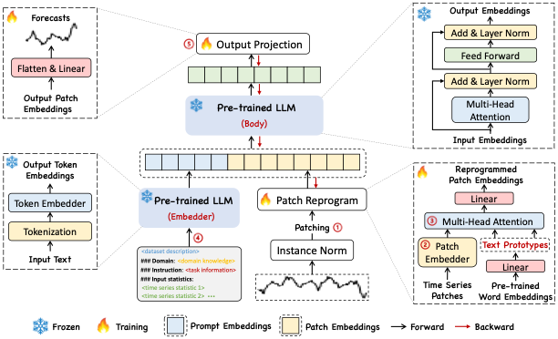

# EEGLLM：基于 LLM 重编程的 EEG 情绪分类

本项目借鉴 [Time-LLM](https://github.com/KimMeen/Time-LLM)（ICLR 2024）的时间序列重编程思路，
把它迁移到脑电信号（EEG）领域，将任务从"时间序列预测"改为"情绪分类"。
在 Time-LLM 的骨架上加入了向量量化（VQ）、重建损失和域对抗学习等模块，
参考了 NeuroLM 的做法，用于缓解 EEG 与 LLM 词空间之间的模态差异。

支持数据集：**DEAP**（32 通道）与 **SEED**（62 通道）。



---

## 目录结构

```
timellm/
├── models/
│   ├── EEGLLM.py              基础模型（RevIN → Patch → Prompt → 重编程 → 冻结 LLM → 分类头）
│   └── EEGLLM_VQ.py           在基础上增加 VQ + 重建损失 + 域对抗/对比学习
├── layers/
│   ├── Embed.py               PatchEmbedding：把 EEG 切 patch 并投影到 d_model
│   └── StandardNorm.py        RevIN 标准化
├── data_provider/
│   ├── data_factory.py        数据入口（DEAP / SEED 二选一）
│   └── data_loader_eeg.py     通道选择 + 滑窗切分 + 标签构造
├── exp/
│   └── exp_classification_vq.py   训练 / 验证 / 测试流程
├── utils/
│   ├── tools.py               EarlyStopping、学习率调整
│   ├── loss_classification.py 分类损失（CE、Focal 等）
│   ├── metrics_classification.py 分类指标（accuracy、precision、recall、F1）
│   └── reconstruction_losses.py  NormEMAVectorQuantizer、重建损失、AdaptiveLossWeighter
├── dataset/prompt_bank/
│   ├── DEAP.txt               DEAP 专用 prompt 文本
│   └── SEED.txt               SEED 专用 prompt 文本
├── figures/                   论文借用的示意图
├── run_main_with_reconstruction.py   训练入口（唯一可用）
├── run_deap_vq.sh             DEAP 数据集的示例启动脚本
├── requirements.txt
└── TimeLLM_VQ改进.md           早期设计笔记（历史文档，可选阅读）
```

> 注意：目录名仍叫 `timellm/` 是因为项目起源于 Time-LLM，改名会牵扯 Python import 路径，
> 为了稳妥保留。模型代码已重命名为 `EEGLLM`。

---

## 核心思路

### 基础模型（`models/EEGLLM.py`）

```
EEG 信号
  ├── ① RevIN 标准化              (Normalize 层，EEGLLM.py init)
  ├── ② Patch 嵌入                 (PatchEmbedding，把序列切 patch 映射到 d_model)
  ├── ③ 生成 Prompt               (基于输入信号的 min/max/median/趋势拼自然语言文本)
  ├── ④ 重编程层                   (ReprogrammingLayer，交叉注意力把 patch 对齐到 LLM 词空间)
  ├── ⑤ 冻结 LLM (LLaMA / GPT-2)   (requires_grad=False，只当特征抽取器)
  └── ⑥ 分类头                     (ClassificationHead：平均池化 + MLP → num_class)
```

### VQ 增强模型（`models/EEGLLM_VQ.py`）

继承自基础模型，在 Patch 嵌入之后插入 VQ，并加入两类辅助损失：

| 模块 | 作用 | 入口 |
|---|---|---|
| Vector Quantization | 把连续 EEG 特征离散化到码本，抑制噪声 | `NormEMAVectorQuantizer` (`utils/reconstruction_losses.py`) |
| 重建损失 | 让量化后的特征仍能重建原信号的频域（FFT 幅度）和时域表示 | `freq_decoder` / `raw_decoder` (`EEGLLM_VQ.py`) |
| 域对抗学习 | 梯度反转 + 域分类器，让 EEG 特征与 LLM 词嵌入在分布上对齐 | `ReverseLayerF` + `domain_classifier` |
| 模态对比学习 | InfoNCE 损失，拉近同位置的 EEG-LLM 特征 | `ModalContrastiveLearning` |
| Alpha 调度 | sigmoid / linear / cosine 控制对抗强度随训练进度变化 | `ModalAlignmentScheduler` |

所有损失通过 `AdaptiveLossWeighter`（可学习权重）组合，再与分类 CrossEntropy 一起回传。

---

## 数据集

### DEAP

- 32 通道 EEG，128Hz 采样
- 原始标签：valence / arousal / dominance / liking（0–9 连续量）
- 本项目支持：
  - **二分类**：按 valence（或 arousal）以 5 为阈值切正/负
  - **四分类**：按 valence × arousal 划分四象限

### SEED

- 62 通道 EEG，200Hz 采样
- 标签：-1 / 0 / 1（负面 / 中性 / 正面），天然三分类

### 通道选择策略（DEAP）

可通过 `--channel_selection` 参数切换：

| 策略名 | 通道数 | 适用场景 |
|--------|--------|----------|
| `comprehensive_emotion` | 14 | 通用情绪分析（默认） |
| `valence_specific` | 8 | valence 二分类 |
| `arousal_specific` | 8 | arousal 二分类 |
| `frontal_emotion` | 9 | 前额叶情绪区域 |
| `frontal_asymmetry` | 6 | 前额叶不对称性分析 |
| `temporal_emotion` | 4 | 颞叶区域 |
| `parietal_attention` | 5 | 顶叶注意相关 |
| `central_motor` | 3 | 中央运动区 |
| `custom_12_channels` | 12 | 自定义混合 12 通道 |

设置 `--use_channel_selection False` 可使用全部 32 / 62 个通道。
完整通道表在 [`data_provider/data_loader_eeg.py`](data_provider/data_loader_eeg.py) 的 `ChannelSelector` 类。

---

## 快速开始

### 1. 环境依赖

```bash
pip install -r requirements.txt
```

关键依赖：`torch==2.2.2`、`transformers==4.31.0`、`accelerate==0.28.0`。
详见 [`requirements.txt`](requirements.txt)。

### 2. 准备数据

- DEAP 放到 `--root_path` 指向的目录（默认 `./datasets/DEAP/`，需要包含 `s01.dat … s32.dat`）
- SEED 同理，放到对应路径下

### 3. 启动训练

最简单的方式是运行示例脚本：

```bash
bash run_deap_vq.sh
```

脚本内部调用 `run_main_with_reconstruction.py`，传入 VQ + 重建 + 域对抗 + 对比学习的全套参数。

### 4. 关键参数

| 参数 | 说明 | 示例 |
|---|---|---|
| `--task_name` | 任务类型，固定 `classification` | `classification` |
| `--data` | 数据集名 | `DEAP` 或 `SEED` |
| `--model` | 模型名 | `EEGLLM_VQ`（推荐）或 `EEGLLM` |
| `--llm_model` | 骨干 LLM | `GPT2` 或 `LLAMA` |
| `--llm_dim` | LLM 隐藏维度 | `768` (GPT-2) / `4096` (LLaMA) |
| `--seq_len` | EEG 窗口长度（采样点） | `256` |
| `--patch_len` / `--stride` | Patch 切分 | `16` / `8` |
| `--n_class` | 分类数 | `2`（valence 二分类）、`3`（SEED） |
| `--channel_selection` | 通道选择策略 | `comprehensive_emotion` |
| `--enable_vq` / `--enable_reconstruction` / `--enable_adversarial` | 是否启用对应模块 | `True` |
| `--loss` | 分类损失 | `CrossEntropyLoss` 或 `focal` |

---

## 引用与致谢

本项目的模型骨架直接改写自 Time-LLM，VQ / 重建 / 域对抗部分参考 NeuroLM。

- Time-LLM: Jin et al., *Time-LLM: Time Series Forecasting by Reprogramming Large Language Models*, ICLR 2024.
- NeuroLM (VQ_Align / Reconstruction) — EEG × LLM 对齐思路来源。
